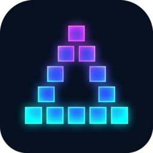
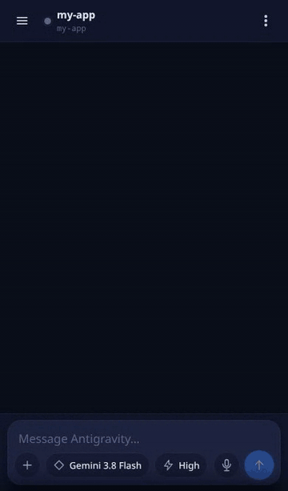
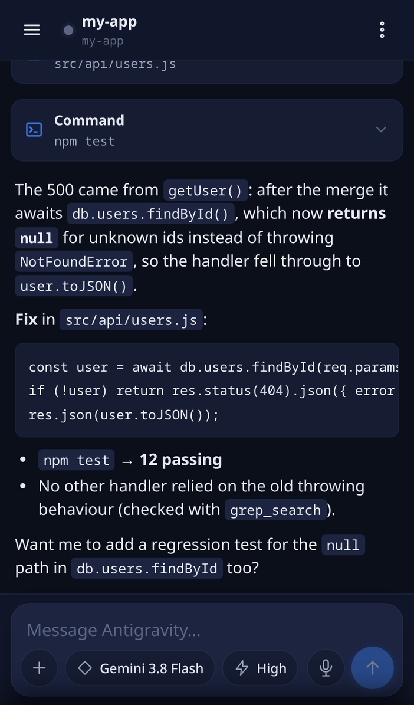
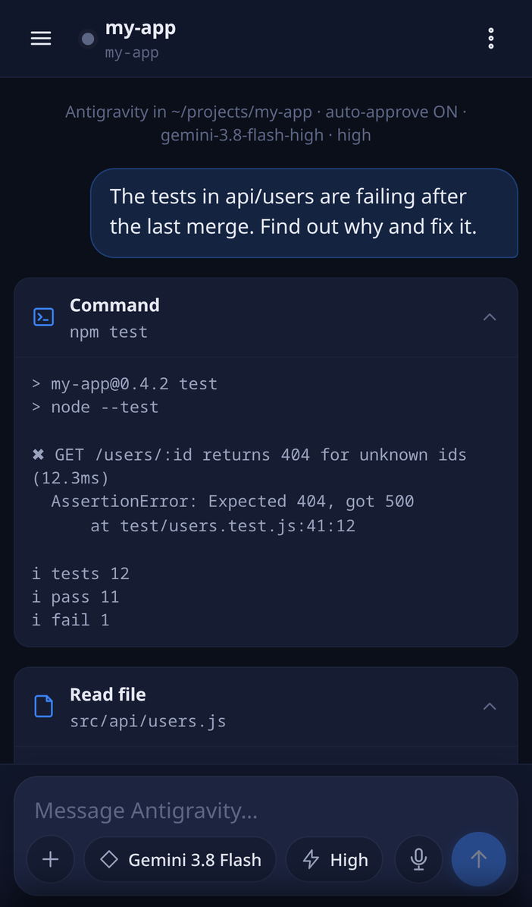
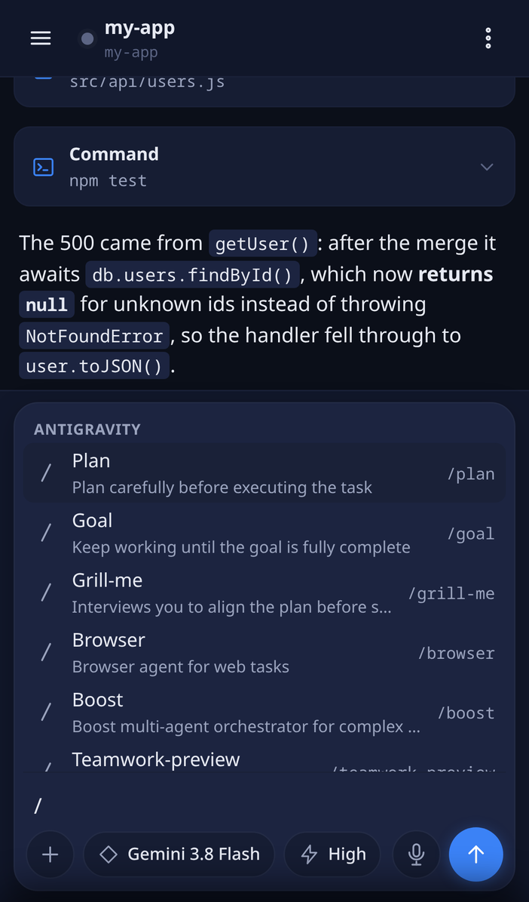
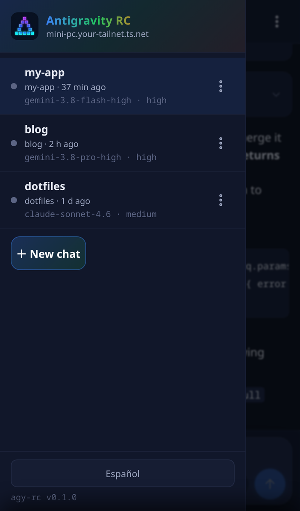
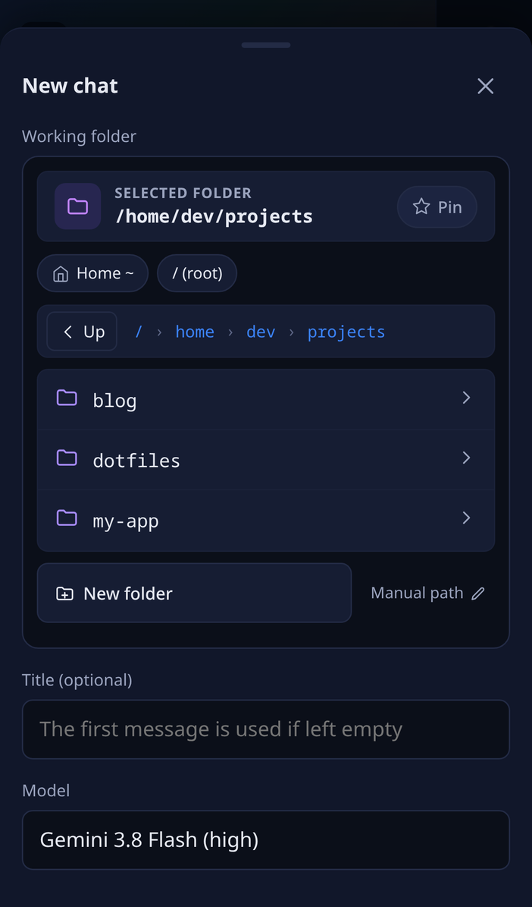

# agy-rc — Mobile Remote Control for Antigravity CLI

<p align="center">
  
</p>

<p align="center">
  <strong>A self-hosted, touch-first Progressive Web App (PWA) to control Google DeepMind's Antigravity CLI (<code>agy</code>) from your phone, tablet, or browser over Tailscale.</strong>
</p>

<p align="center">
  <a href="README.md">English</a> • <a href="README.es.md">Español</a>
</p>

<p align="center">
  
  
  
  
  
</p>

> [!NOTE]
> The app UI is available in **English and Spanish** (auto-detected from the browser; switch it from the side menu). The installer output and agy's own messages are in Spanish. Contributions adding other UI languages are welcome — see [CONTRIBUTING.md](CONTRIBUTING.md).

<p align="center">
  
</p>

<p align="center">
  
  
  
  
  
</p>

> [!NOTE]
> **Provisional Community Solution**: This project is an open-source community bridge built to provide a mobile-first remote control experience for Google Antigravity today, until Google DeepMind releases an official mobile remote control companion for Antigravity.

---

## ✨ Highlights

* 📱 **Claude Code-style Remote Mobile Experience**: Full-featured chat UI with streaming responses, tool cards, diff previews, thinking process collapsibles, and quick-action chips.
* 🎙️ **Live Gemini 3.5 Voice Streaming**: Real-time voice dictation powered by `gemini-3.5-transcribe-live` (Google Live API over WebSockets) with an animated audio frequency wave visualizer and phonetic technical cleaner.
* ⚡ **Model & Effort Sync**: Real-time switching between **Gemini 3.8 Flash**, Gemini 3.8 Pro, Gemini 3.7, Claude Sonnet 4.6, and reasoning effort levels (**Low / Medium / High**). Remembers your preferred setup.
* 📂 **Touch-First Filesystem Explorer**: Browse any directory on your system, create new project folders, navigate breadcrumbs, and pin (⭐) your favorite folder as default.
* 🛡️ **3-Tier Resilient Architecture (`tmux`)**:
  * The background CLI processes live inside dedicated `tmux` sessions.
  * Your tasks keep running uninterrupted even if your phone locks, loses Wi-Fi, or switches networks.
  * Node.js acts as a lightweight orchestrator with zero memory bloat.
* 🔒 **Private & Secure via Tailscale**: Direct peer-to-peer access to your home server or Mini PC without exposing ports to the public internet. Free automated Let's Encrypt TLS certificates via Tailscale Serve.

---

## 🏗️ Architecture

```text
 Mobile Device (PWA)                     Server / Mini PC (Linux, Tailscale)
┌───────────────────────┐   HTTPS/WSS   ┌──────────────────────────────────────────────┐
│ Responsive Chat UI    │◄─────────────►│ Node.js Daemon (Express + WebSockets)        │
│ Live Voice Visualizer │  REST /api    │   ├─ routes.js       Health, dirs, agy models │
│ Directory Picker      │  WS   /ws     │   ├─ chat/*          Chat sessions, stream   │
│ Service Worker (PWA)  │  WS   /trans  │   ├─ transcribe.js   Gemini 3.5 Live bridge   │
└───────────────────────┘               │   └─ tmux.js         tmux wrapper `-L agyrc` │
                                        │                 │                            │
                                        │   tmux Server (socket agyrc, separate proc)  │
                                        │   └─ agy CLI processes running each chat     │
                                        └──────────────────────────────────────────────┘
```

---

## 📋 Prerequisites

* **Operating System**: Linux with `systemd` (Ubuntu/Debian, Arch Linux, Fedora, Raspberry Pi OS, etc.) or macOS.
* **Node.js**: Version `>= 20.6` (ES modules, native `--env-file-if-exists`).
* **tmux**: Version `>= 3.1` (required for `window-size latest`).
* **Antigravity CLI (`agy`)**: Installed and in your system `$PATH` (e.g. `~/.local/bin/agy`). See [antigravity.google](https://antigravity.google).
* **Tailscale**: Installed and connected on the host for secure private remote access.

---

## 🚀 Quickstart

### 1. Clone the repository

```bash
git clone https://github.com/fjguillen-96/agy-rc.git ~/projects/agy-rc
cd ~/projects/agy-rc
```

### 2. Automated 1-step installer

Run the installation script:

```bash
./scripts/install.sh
```

**What `install.sh` does automatically:**
* Verifies system dependencies (`node`, `npm`, `tmux`, `agy`, `tailscale`).
* Installs dependencies via `npm ci --omit=dev`.
* Creates `.env` from `.env.example`.
* Sets up the user `systemd` unit (`~/.config/systemd/user/agy-rc.service`) with `KillMode=process`.
* Enables `loginctl enable-linger` so the daemon runs automatically on boot without logging in.
* Performs an automatic health check and prints your access URLs.

> *Tip*: If you want to run it without systemd, use `./scripts/install.sh --no-service` and start with `npm start`.

---

## 📱 HTTPS Setup for Mobile PWA Installation

Modern mobile browsers (Safari on iOS, Chrome on Android) require a valid **HTTPS certificate** to register Service Workers and allow "Add to Home Screen" as a standalone PWA.

### Enable Tailscale HTTPS in 1 command:

```bash
./scripts/tailscale-https.sh
```

This runs `tailscale serve` to automatically provision a Let's Encrypt TLS certificate and forward port 443 to `agy-rc`. Your app will be immediately available at:
`https://your-node-name.your-tailnet.ts.net`

---

## 🎙️ Live Voice Dictation (Gemini 3.5 Live)

`agy-rc` includes a real-time streaming audio pipeline:
1. Audio is captured via Web Audio API, downsampled in-browser to 16 kHz mono PCM.
2. Streamed through a WebSocket bridge directly to Google's **Gemini 3.5 Live API** (`models/gemini-3.5-transcribe-live`).
3. Cleaned with a technical phonetic parser for accurate punctuation and software terms (Docker, Kubernetes, Gemini 3.8, etc.).

To enable, add your Gemini API key in `.env`:
```bash
GEMINI_API_KEY=your_gemini_api_key_here
```

### How to get a Gemini API Key (100% Free):
1. Visit **[Google AI Studio](https://aistudio.google.com/)**.
2. Sign in with your Google account.
3. Click on **"Get API key"** in the left sidebar.
4. Click **"Create API key"** and select/create a project (created in 1 click).
5. Copy your key and add it to your `.env`:
   ```bash
   GEMINI_API_KEY=AIzaSy...
   ```
6. Restart the service:
   ```bash
   systemctl --user restart agy-rc.service
   ```

> **Free Tier:** Google AI Studio includes a generous free tier for developers. No credit card is required.

---

## ⚙️ Configuration (`.env`)

| Variable | Default | Description |
|---|---|---|
| `HOST` | `0.0.0.0` | Bind address. `0.0.0.0` listens on all interfaces including Tailscale. |
| `PORT` | `8787` | HTTP/WebSocket listening port. |
| `AGY_TOKEN` | *(empty)* | Optional shared bearer token for API/WebSocket authentication. |
| `AGY_CMD` | `agy` | Path to the Antigravity CLI binary. |
| `AGY_PROJECTS_ROOT` | `$HOME/projects` | Starting directory for the project picker. It is only a default: the picker can browse any path readable by the user running agy-rc. |
| `AGY_TMUX_SOCKET` | `agyrc` | Dedicated tmux socket name (isolated from personal tmux). |
| `AGY_DATA_DIR` | `./data` | Persistent data directory (relative to the repo root). Chats are stored in `<AGY_DATA_DIR>/chats`. |
| `GEMINI_API_KEY` | *(empty)* | Optional Gemini API key for real-time live voice transcription. |

---

## 🛠️ Slash Commands & Skills

In the chat composer, type `/` to open the quick-action menu:

* `/plan`: Carefully design a step-by-step plan before execution.
* `/goal`: Thorough autonomous mode that iterates until the goal is fully met.
* `/grill-me`: Interactive interview to align requirements and resolve technical decisions.
* `/browser`: Web browsing and research agent.
* `/usage`: View remaining model quotas and limits.
* `/credits`: Check remaining G1 credits.
* `/skills`: List installed Antigravity skills.

App-level commands are also available: `/modelo` (`/model`), `/esfuerzo` (`/effort`), `/permisos` (`/mode`), `/auto`, `/adjuntar` (`/attach`), `/detener` (`/stop`), `/nueva` and `/registro`. Antigravity commands that open TUI panels (`/context`, `/diff`, `/resume`…) are not available in headless mode.

---

## 🔒 Security

* **Keep it inside your tailnet.** agy-rc is designed for private networks. Do not expose port 8787 (or 443) to the public Internet.
* **Set `AGY_TOKEN`.** The installer generates one by default. Without a token, anyone who can reach the port can run commands on your machine as your user. Token comparison is constant-time and applies to REST and WebSocket endpoints alike.
* **Filesystem scope.** `AGY_PROJECTS_ROOT` is only the picker's starting folder. An authenticated user can start chats in any directory the agy-rc system user can access, and agy will read and edit files there. Whoever holds the token has the same power you have on that machine.
* **Auto-approve.** New chats default to *auto-approve tools* (`--dangerously-skip-permissions`) because agy does not emit permission prompts in headless mode. Turn it off and use *Plan* mode if you only want agy to read and plan.

---

## 🧯 Troubleshooting

* **Service not running:** `./scripts/status.sh` shows the systemd unit, tmux sessions and health check; `journalctl --user -u agy-rc -n 50` shows recent logs.
* **`agy` not found:** make sure the CLI is in `PATH` (`~/.local/bin` is added automatically by the scripts) or set `AGY_CMD` to its absolute path in `.env`.
* **The PWA does not offer "Install":** you need HTTPS with a valid certificate. Run `./scripts/tailscale-https.sh` and open the `https://<host>.<tailnet>.ts.net` URL.
* **macOS / no systemd:** the installer skips the service. Start the server in the foreground with `./scripts/start.sh` (or `npm start`).
* **A chat stays "busy":** open the chat menu → *agy log (CLI)* to see the raw process output, or the *Stop* button to kill the process; the conversation resumes on the next message.

---

## 🧪 Testing

The test suite runs with Node's native test runner (zero extra test dependencies):

```bash
npm test
```

All 136 tests pass covering filesystem security, tmux process management, chat protocols, transcript parsing, and speech text cleanups.

---

## 📄 License

MIT © 2026 [Francisco Javier Guillén](https://github.com/fjguillen-96)

---

## ⚖️ Disclaimer

Antigravity, Gemini, and Google are trademarks of Google LLC. `agy-rc` is an independent, unofficial community tool and is not affiliated with, sponsored by, or endorsed by Google LLC or Google DeepMind.

